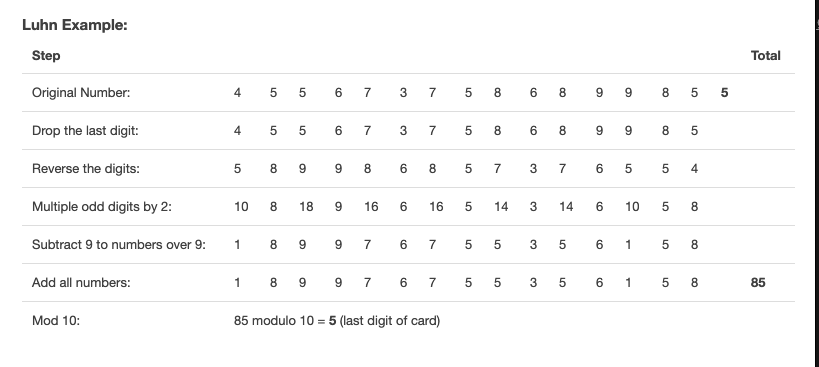

# Credit Card Number Verification

## About
This is a simple Credit Card Number Verification project that was built in plain html and css.
You can open the static page in the browser and validate a credit card number.
This project contains Luhn algorithm implementation in JavaScript.

## What is Luhn algorithm?
Most credit card number can be validated using the Luhn algorithm, which is more or a less a glorified Modulo 10 formula!

### The Luhn Formula:
1. Drop the last digit from the number. The last digit is what we want to check against
2. Reverse the numbers
3. Multiply the digits in odd positions (1, 3, 5, etc.) by 2 and subtract 9 to all any result higher than 9
4. Add all the numbers together
5. The check digit (the last number of the card) is the amount that you would need to add to get a multiple of 10 (Modulo 10)

## Reference
- [Credit Card Number Generator & Validator](https://www.freeformatter.com/credit-card-number-generator-validator.html#fakeNumbers)
